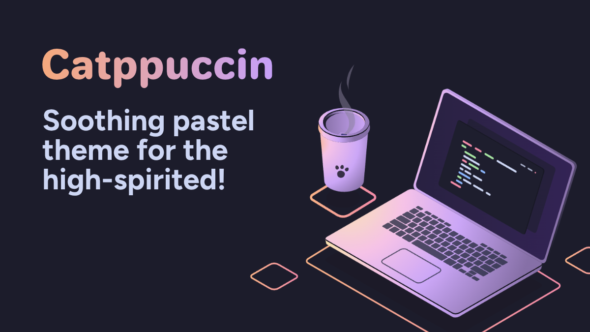

<h3 align="center">
	<br/>
	
	Catppuccin for <a href="https://info.cern.ch/hypertext/WWW/TheProject.html">World Wide Web</a>
	
</h3>

<p align="center">
	<a href="https://github.com/catppuccin/website/stargazers"></a>
	<a href="https://github.com/catppuccin/website/issues"></a>
	<a href="https://github.com/catppuccin/website/contributors"></a>
</p>

<p align="center">
	
</p>

## Development

```
bun install
bun dev
```

<p align="center">

[](https://vercel.com/?utm_source=Catppuccin&utm_campaign=oss)

</p>
