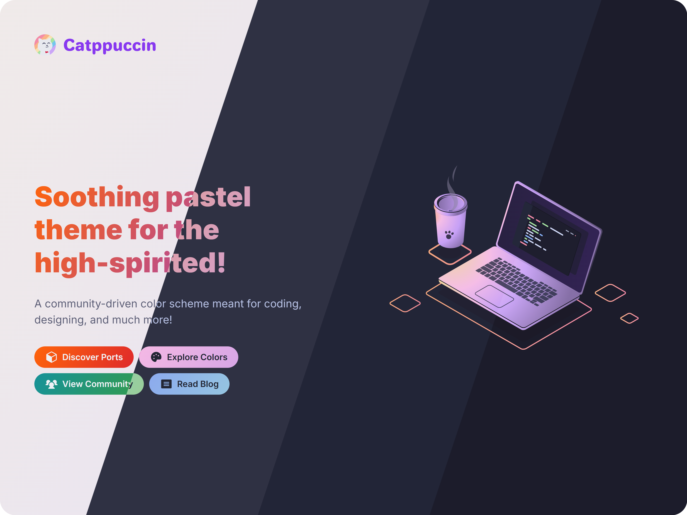

<h3 align="center">
	<br/>
	
	Catppuccin for <a href="https://info.cern.ch/hypertext/WWW/TheProject.html">World Wide Web</a>
	
</h3>

<p align="center">
	<a href="https://github.com/catppuccin/website/stargazers"></a>
	<a href="https://github.com/catppuccin/website/issues"></a>
	<a href="https://github.com/catppuccin/website/contributors"></a>
</p>

<p align="center">
	
</p>

## Usage

1. Open your browser of choice
2. Put cursor in address bar
3. Type https://catppuccin.com
4. Press enter 😁

## Development

```
bun install
bun dev
```

&nbsp;

<p align="center">
	
</p>
<p align="center">Copyright &copy; 2021-present <a href="https://github.com/catppuccin" target="_blank">Catppuccin Org</a>
<p align="center">
	<a href="https://github.com/catppuccin/catppuccin/blob/main/LICENSE"></a>
</p>
<p align="center">
	<a href="https://vercel.com?utm_source=catppuccin&utm_campaign=oss"></a>
</p>
